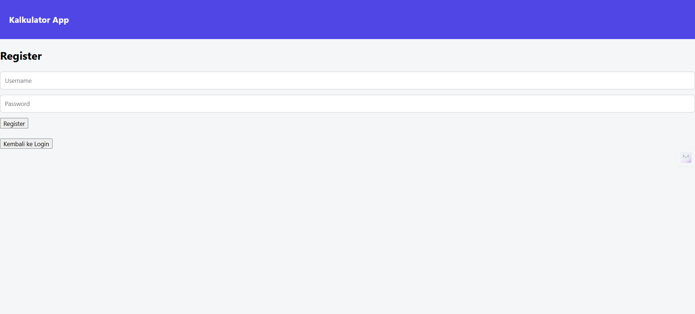
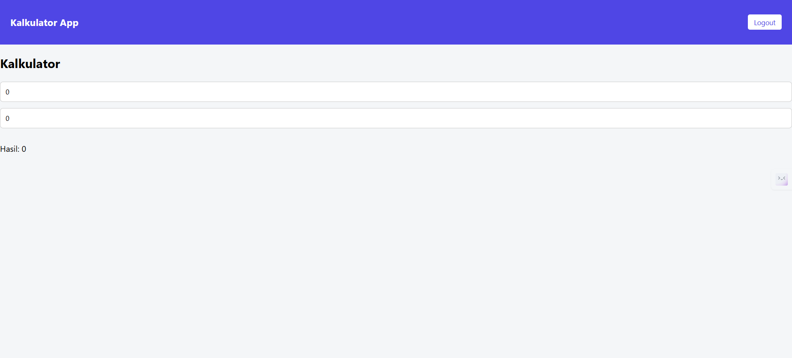

# React Calculator App with Authentication

This project is a React calculator application that implements a simple authentication flow
(login & register) and manual routing using React state.

The main goal of this project is to demonstrate React fundamentals, component-based architecture,
and state-driven UI rendering.

## 🚀 Features
- Calculator with separated business logic
- Login & Register authentication flow
- Authentication state management
- Manual routing using React state
- LocalStorage persistence
- Conditional rendering based on user state
- Component-based architecture

## 🛠 Tech Stack
- React (useState, props)
- JavaScript (ES6)
- LocalStorage
- Vite / CRA (adjust based on your setup)

## 📂 Project Structure
src/
├─ components/
│ ├─ Navbar.jsx
│ ├─ Button.jsx
│ └─ Input.jsx
├─ pages/
│ ├─ Login.jsx
│ ├─ Register.jsx
│ └─ Calculator.jsx
├─ utils/
│ └─ calculate.js
├─ App.jsx
└─ main.jsx

---

## 🧩 Key Concepts Implemented

- Lifting state up
- Parent–child communication via props
- Conditional rendering
- Separation of concerns
- Manual routing without external libraries
- Basic authentication simulation using LocalStorage

---

## 🔒 Notes

This project uses LocalStorage to simulate authentication.
It is intended for learning and portfolio purposes only,
not for production use.

---

## ▶️ How to Run the Project

1. Clone this repository
        ```bash
    git clone https://github.com/Basybasyaa/react-calculator-auth.git

2. Install dependencies
    npm install

3. Run the development server
    npm run dev

📈 Possible Improvements

. Implement React Router for URL-based routing
. Integrate backend authentication (API)
. Add form validation
. Add calculation history
. Improve UI/UX and responsiveness

## 📸 Screenshots

### Login Page


### Register Page


### Calculator



👤 Author
Basy Basya
Junior Frontend Developer (React)
